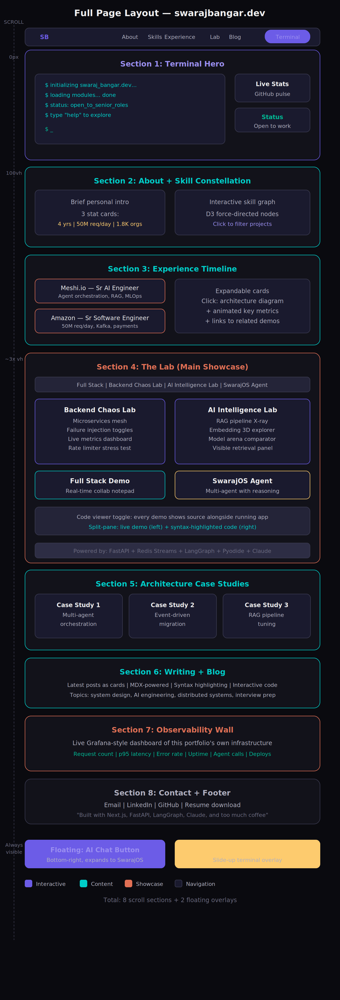
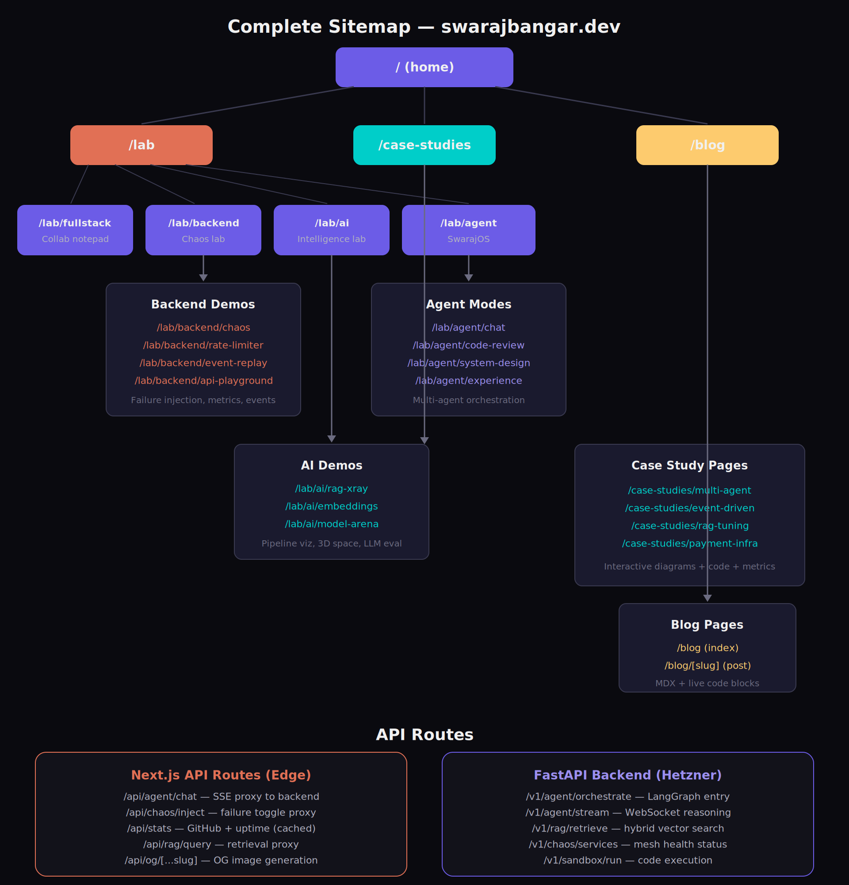
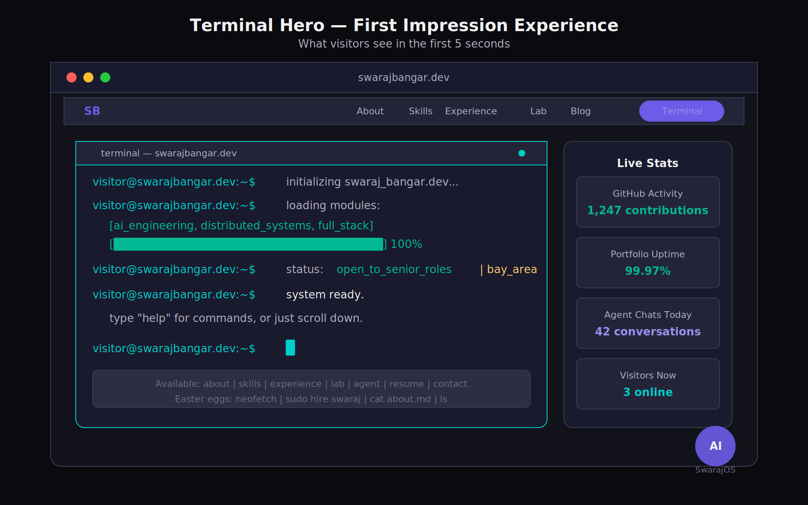
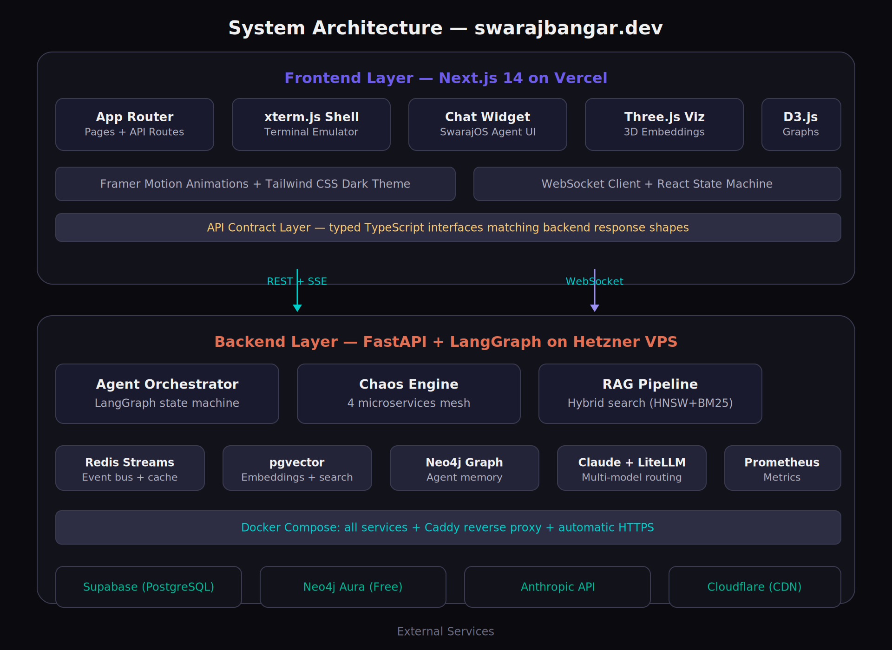
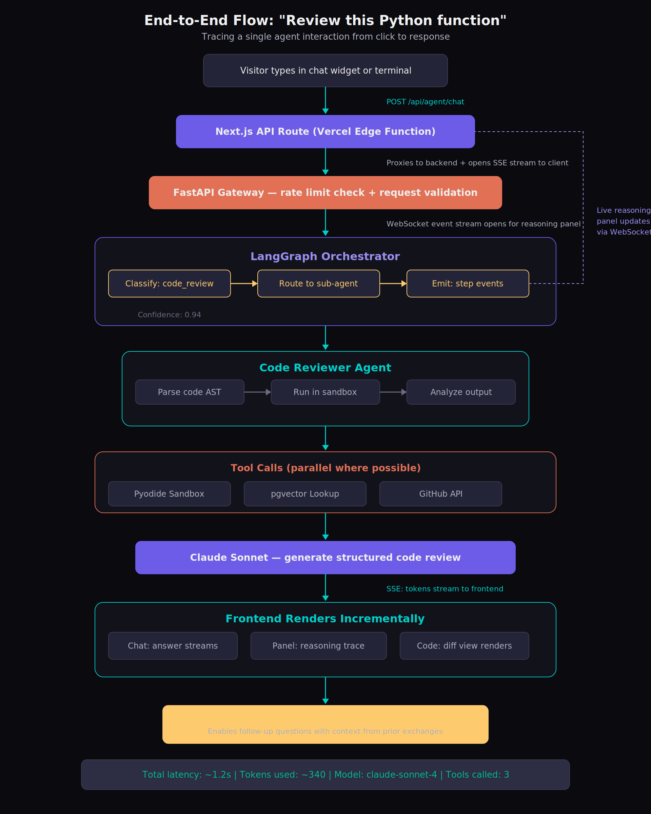

# PRODUCT REQUIREMENTS DOCUMENT

**swarajbangar.dev — The Portfolio That Proves Itself**

> A multi-agent, interactive portfolio system that demonstrates full-stack, backend, and AI engineering expertise through live, working demos

---

| Field | Value |
| --- | --- |
| Author | Swaraj Bangar |
| Version | 1.0 |
| Date | March 2026 |
| Status | Ready for Development |

---

# 1. Executive Summary

## 1.1 Product Vision

swarajbangar.dev is not a portfolio website. It is a live, interactive engineering system disguised as a personal site. Every section is a working demo, every feature is a proof of competence, and the portfolio itself is the most impressive project on it. The site targets senior engineering and AI engineering hiring managers, CTOs, and technical recruiters who are tired of bullet-point resumes and static project screenshots.

## 1.2 Core Objective

Build a dark-mode, terminal-inspired portfolio platform that demonstrates full-stack, backend systems, and AI/ML engineering expertise through interactive, real-time demos rather than static descriptions. The portfolio should function as a product: fast, polished, memorable, and technically deep enough that an engineering manager spends 5+ minutes exploring it.

## 1.3 Success Criteria

- Average session duration above 3 minutes (industry portfolio average is 45 seconds)
- At least 60% of visitors interact with at least one live demo
- Terminal or agent chat engagement rate above 25%
- Lighthouse performance score of 95+ on all pages
- Time to First Contentful Paint under 1.2 seconds
- Zero critical accessibility violations (WCAG 2.1 AA)
- Portfolio generates inbound interview requests within 30 days of launch

## 1.4 Target Audience

| Persona | What They Care About | What Impresses Them |
| --- | --- | --- |
| Hiring Manager (Sr/Staff Eng) | Can this person build production systems? | Live demos, system design depth, real metrics |
| CTO / VP Engineering | Does this person think at an architectural level? | Visible tradeoff reasoning, agent orchestration, observability |
| AI Engineering Lead | Does this person understand RAG, agents, evals beyond API wrappers? | RAG pipeline X-ray, embedding explorer, model arena |
| Technical Recruiter | Quick signal: is this person strong? | Terminal wow-factor, polished UX, fast page loads |
| Peer Engineer | Is this person legit? | Code quality in view-source, GitHub integration, real backend running |

# 2. Design System

## 2.1 Design Philosophy

The design language is engineer-native: dark, focused, information-dense without feeling cluttered. Think of the aesthetic as a cross between a premium developer tool (Linear, Raycast, Warp terminal) and a data-rich dashboard (Grafana, Datadog). Every pixel should feel intentional. The site should look like it was built by someone who cares about craft, not someone who downloaded a template.

### 2.1.1 Core Design Principles

- Dark-first: designed for dark mode from the ground up, not adapted from a light theme
- Terminal-native: monospace accents, command-line patterns, keyboard-first interactions
- Information density: show more, scroll less, but never feel cluttered
- Motion with purpose: every animation communicates state change, never decorative
- Progressive disclosure: simple on the surface, deep on interaction
- Code as aesthetic: syntax highlighting, terminal prompts, and API responses are design elements

## 2.2 Color System

### 2.2.1 Background Layers

The dark mode uses a layered depth system with subtle tonal shifts to create visual hierarchy without borders. Each layer is slightly lighter than the one below it, creating a natural sense of elevation.

| Swatch | Hex | Token Name | Usage |
| --- | --- | --- | --- |
|  | #0A0A0F | bg-base | Page body, deepest layer |
|  | #12121A | bg-surface | Card backgrounds, panels |
|  | #1A1A2E | bg-elevated | Modals, dropdowns, hover states |
|  | #242438 | bg-interactive | Input fields, active states |
|  | #2D2D44 | bg-highlight | Code blocks, selected items |

### 2.2.2 Accent Colors

The accent palette uses five saturated colors for semantic meaning. These are never used for large fills, only for interactive elements, status indicators, highlights, and emphasis. The primary accent (electric purple) carries the brand; others are functional.

| Swatch | Hex | Token Name | Usage |
| --- | --- | --- | --- |
|  | #6C5CE7 | accent-primary (Electric Purple) | CTAs, links, focus rings, brand |
|  | #00CEC9 | accent-teal (Cyber Teal) | Success states, live indicators, terminal prompt |
|  | #FD79A8 | accent-pink (Soft Pink) | Errors, warnings, attention badges |
|  | #FDCB6E | accent-gold (Warm Gold) | Highlights, star ratings, premium indicators |
|  | #00B894 | accent-emerald (Emerald) | Online status, uptime, health indicators |
|  | #E17055 | accent-coral (Warm Coral) | Destructive actions, chaos injection, hot paths |

### 2.2.3 Text Colors

| Swatch | Hex | Token Name | Usage |
| --- | --- | --- | --- |
|  | #F0F0F0 | text-primary | Headings, primary content |
|  | #B0B0C0 | text-secondary | Body text, descriptions |
|  | #6B6B80 | text-muted | Captions, timestamps, hints |
|  | #4A4A5E | text-disabled | Inactive states, placeholders |

### 2.2.4 Border and Glow Effects

Borders are subtle and use transparency rather than solid colors. The glow system creates depth for interactive elements without box-shadows. All glows use the accent-primary color at low opacity.
- border-default: 1px solid rgba(255, 255, 255, 0.06) for card edges
- border-hover: 1px solid rgba(255, 255, 255, 0.12) on hover states
- border-focus: 1px solid #6C5CE7 with box-shadow: 0 0 0 3px rgba(108, 92, 231, 0.15)
- glow-subtle: box-shadow: 0 0 20px rgba(108, 92, 231, 0.08) for elevated cards
- glow-active: box-shadow: 0 0 30px rgba(108, 92, 231, 0.15) for active/focused elements
- Terminal cursor glow: box-shadow: 0 0 8px rgba(0, 206, 201, 0.6) pulsing animation

## 2.3 Typography

### 2.3.1 Font Stack

The typography system uses two font families: a geometric sans-serif for UI text and headings, and a monospace font for code, terminal output, and technical content. The monospace font is treated as a first-class design element, not an afterthought.
- Primary (UI): Inter, -apple-system, BlinkMacSystemFont, sans-serif
- Monospace (Code/Terminal): JetBrains Mono, Fira Code, SF Mono, monospace
- Accent (Special headings only): Space Grotesk for hero section h1

### 2.3.2 Type Scale

| Token | Size | Weight | Usage |
| --- | --- | --- | --- |
| display | 48px / 3rem | 700 | Hero heading only |
| h1 | 36px / 2.25rem | 700 | Section headings |
| h2 | 28px / 1.75rem | 600 | Subsection headings |
| h3 | 22px / 1.375rem | 600 | Card titles, feature names |
| body-lg | 18px / 1.125rem | 400 | Lead paragraphs, descriptions |
| body | 16px / 1rem | 400 | Standard body text |
| body-sm | 14px / 0.875rem | 400 | Captions, labels, metadata |
| code | 14px / 0.875rem | 400 | Inline code, terminal text |
| code-sm | 12px / 0.75rem | 400 | Code annotations, line numbers |
| overline | 12px / 0.75rem | 600 | Section labels, uppercase with 2px letter-spacing |

### 2.3.3 Line Heights and Spacing

- Headings: line-height 1.2 for tight, punchy headlines
- Body text: line-height 1.6 for comfortable reading
- Code/terminal: line-height 1.5 with slightly increased letter-spacing (0.02em)
- Paragraph spacing: 1rem (16px) between paragraphs, 2rem before section headings

## 2.4 Layout and Spacing

### 2.4.1 Grid System

The layout uses a 12-column CSS Grid with a max-width constraint. The grid adapts at three breakpoints, with mobile taking priority for content readability.
- Max content width: 1280px (80rem) centered with auto margins
- Column gutter: 24px (1.5rem) default, 16px on mobile
- Section padding: 96px (6rem) vertical on desktop, 64px (4rem) on tablet, 48px (3rem) on mobile
- Container padding: 24px (1.5rem) horizontal on desktop, 16px on mobile

### 2.4.2 Spacing Scale (8px base)

| Token | Value | Usage |
| --- | --- | --- |
| space-1 | 4px | Tight gaps within components (icon-to-label) |
| space-2 | 8px | Default component internal padding |
| space-3 | 12px | Between related items in a list |
| space-4 | 16px | Between components in a group |
| space-6 | 24px | Card internal padding, grid gutter |
| space-8 | 32px | Between component groups |
| space-12 | 48px | Between major sections (mobile) |
| space-16 | 64px | Between major sections (tablet) |
| space-24 | 96px | Between major sections (desktop) |

### 2.4.3 Breakpoints

| Name | Min Width | Columns | Behavior |
| --- | --- | --- | --- |
| mobile | 0px | 1 (stacked) | Single column, full-width cards |
| tablet | 768px | 2 | Side-by-side cards, compact nav |
| desktop | 1024px | 12 (flexible) | Full grid, all features visible |
| wide | 1440px | 12 (capped) | Content capped at 1280px, centered |

## 2.5 Component Design Tokens

### 2.5.1 Cards

Cards are the primary container for content throughout the site. They use the surface layer as background with a subtle border for definition. Interactive cards have a hover state that elevates them slightly.
- Background: var(--bg-surface) (#12121A)
- Border: 1px solid rgba(255, 255, 255, 0.06)
- Border-radius: 12px
- Padding: 24px
- Hover: border-color transitions to rgba(255, 255, 255, 0.12), transform: translateY(-2px), glow-subtle applied
- Active: scale(0.99) for 100ms on click
- Transition: all 200ms cubic-bezier(0.4, 0, 0.2, 1)

### 2.5.2 Buttons

- Primary: bg #6C5CE7, text white, hover #7C6CF7, active #5C4CD7, border-radius 8px
- Secondary: bg transparent, border 1px solid rgba(255,255,255,0.12), text-primary, hover bg rgba(255,255,255,0.04)
- Ghost: bg transparent, no border, text-secondary, hover text-primary
- Danger: bg #FD79A8 at 10% opacity, text #FD79A8, hover bg at 20% opacity
- All buttons: height 40px, padding 0 16px, font-size 14px, font-weight 500, transition 150ms

### 2.5.3 Input Fields

- Background: var(--bg-interactive) (#242438)
- Border: 1px solid rgba(255, 255, 255, 0.08)
- Focus: border-color #6C5CE7, box-shadow 0 0 0 3px rgba(108, 92, 231, 0.15)
- Text: var(--text-primary), placeholder var(--text-muted)
- Height: 40px, border-radius 8px, padding 0 12px

### 2.5.4 Badges and Pills

- Background: accent color at 12% opacity
- Text: full accent color
- Border-radius: 100px (pill shape)
- Padding: 2px 10px, font-size 12px, font-weight 500
- Example: the 'Live' indicator uses accent-emerald with a pulsing dot animation

## 2.6 Motion and Animation

### 2.6.1 Animation Principles

- Every animation must communicate a state change or draw attention to new content. Decorative animation is prohibited.
- Prefer CSS transitions over JS animations. Use Framer Motion only for complex sequences (page transitions, staggered reveals, spring physics).
- All animations must respect prefers-reduced-motion. When reduced motion is preferred, replace transitions with instant state changes.

### 2.6.2 Timing Tokens

| Token | Duration | Easing | Usage |
| --- | --- | --- | --- |
| instant | 0ms | none | Reduced motion fallback |
| fast | 150ms | ease-out | Button hover, toggle, focus rings |
| normal | 250ms | cubic-bezier(0.4, 0, 0.2, 1) | Card hover, panel open/close |
| slow | 400ms | cubic-bezier(0.4, 0, 0.2, 1) | Section reveal, page transitions |
| spring | 500ms | spring(1, 100, 10, 0) | Terminal boot, hero text entry (Framer Motion) |

### 2.6.3 Scroll Animations

Sections use Intersection Observer-triggered animations as they enter the viewport. The animation is a subtle fade-up: elements start at opacity 0 and translateY(20px), then animate to opacity 1 and translateY(0) over 400ms with a stagger delay of 80ms per child element. Each section only animates once, on first entry. The terminal hero section uses a typewriter animation for the boot sequence at 40ms per character with a blinking cursor.

## 2.7 Design Inspiration References

The following are reference points for the visual language, not templates to copy. The portfolio should feel original while drawing from the best patterns in developer tooling and creative portfolios.
- Linear.app: dark surface layering, subtle borders, motion quality, information density
- Raycast.com: command palette UX, keyboard-first design, clean dark aesthetic
- Warp.dev: terminal-as-product thinking, monospace typography as design element
- Vercel.com/docs: content hierarchy, clean navigation, technical writing quality
- Stripe.com/docs: interactive code examples, progressive disclosure, developer-centric design
- Grafana dashboards: real-time data visualization, metrics density, dark mode data presentation
- Leerob.io (Lee Robinson): developer portfolio structure, MDX blog integration, clean personal branding

# 3. Sitemap and Information Architecture

*Figure 2: Full page layout — scroll experience from hero to footer*

## 3.1 Route Structure

*Figure 3: Complete sitemap — all routes, pages, and API surfaces*

| Route | Type | Description |
| --- | --- | --- |
| / | Static + Dynamic | Home page with 8 scrollable sections, hero terminal, all entry points |
| /lab | Dynamic | Lab overview showing all 4 demo categories as cards |
| /lab/fullstack | Interactive | Real-time collaborative notepad demo |
| /lab/backend | Interactive | Distributed systems chaos lab (tabbed sub-demos) |
| /lab/backend/chaos | Interactive | Microservices failure injection demo |
| /lab/backend/rate-limiter | Interactive | Token bucket visualizer with stress test |
| /lab/backend/event-replay | Interactive | Event sourcing timeline with rewind |
| /lab/backend/api-playground | Interactive | Live Swagger-style API explorer |
| /lab/ai | Interactive | AI Intelligence Lab (tabbed sub-demos) |
| /lab/ai/rag-xray | Interactive | RAG pipeline visualization with live query |
| /lab/ai/embeddings | Interactive | 3D embedding space explorer (Three.js) |
| /lab/ai/model-arena | Interactive | Side-by-side LLM comparison tool |
| /lab/agent | Interactive | SwarajOS multi-agent chat interface |
| /case-studies | Static | Case study index page |
| /case-studies/[slug] | MDX | Individual case study with interactive diagrams |
| /blog | Static | Blog post index with tags and reading time |
| /blog/[slug] | MDX | Individual blog post with live code blocks |

## 3.2 Navigation Architecture

The primary navigation is a sticky top bar that transforms on scroll. On initial load, it is transparent and overlays the hero. After scrolling past the hero (approximately 100vh), it gains a frosted glass background (backdrop-filter: blur(12px) with bg-base at 80% opacity) and a subtle bottom border. The nav contains the logo/monogram (SB), five section links, and a terminal toggle button.
The secondary navigation method is the terminal itself. Users can type any route as a command, and the terminal parser navigates to that section or page. This creates a dual-input pattern: visual navigation for scanners, keyboard navigation for power users.

### 3.2.1 Navigation Items

| Label | Target | Behavior |
| --- | --- | --- |
| About | /#about | Smooth scroll to About section on home |
| Skills | /#skills | Smooth scroll to interactive skill graph |
| Experience | /#experience | Smooth scroll to timeline |
| Lab | /lab | Route to lab overview (or scroll to lab section on home) |
| Blog | /blog | Route to blog index |
| Terminal | Overlay | Toggle slide-up terminal panel |

## 3.3 Floating Elements (Always Visible)

- AI Chat Button: Fixed position bottom-right (24px from edges). 56px circle with accent-primary background and subtle glow. Expands into a 400px wide chat panel on click. The panel slides up from the bottom-right with a spring animation. Shows a notification dot (accent-pink) when the agent has proactive suggestions.
- Terminal Toggle: Located in the nav bar. On click, a terminal panel slides up from the bottom of the viewport, covering the bottom 50% of the screen with a frosted glass overlay above. The terminal can be resized by dragging the top edge. Pressing Escape or clicking the overlay dismisses it.

# 4. Feature Specifications

## 4.1 Section 1: Terminal Hero

*Figure 1: Terminal Hero — first impression experience mockup*

### 4.1.1 Overview

The hero section occupies the full viewport height (100vh) and features a terminal emulator as its centerpiece. On page load, the terminal runs a boot sequence animation that introduces the visitor to Swaraj, his skills, and the navigation options. The terminal is fully interactive: visitors can type real commands after the boot sequence completes.

### 4.1.2 Boot Sequence

The boot sequence types out line by line at 40ms per character with a 200ms pause between lines. The sequence is designed to convey competence and personality in under 8 seconds. After the sequence completes, the cursor blinks and awaits input.
$ initializing swaraj_bangar.dev...
$ loading modules: [ai_engineering, distributed_systems, full_stack]
$ connecting to: meshi.io | amazon | csu_east_bay
$ status: open_to_senior_roles | bay_area | h1b_ready
$ system ready. type 'help' for commands, or just scroll.
$ _

### 4.1.3 Terminal Commands

| Command | Action | Output |
| --- | --- | --- |
| help | Show available commands | Formatted command list with descriptions |
| about | Navigate to about section | Smooth scroll + brief text output |
| skills | Navigate to skills section | Animated skill list in terminal, then scroll |
| experience | Navigate to experience section | Timeline summary, then scroll |
| projects / lab | Navigate to lab | Project list with links, then scroll or route |
| resume | Open resume | Opens resume PDF in new tab |
| contact | Show contact info | Email, LinkedIn, GitHub with clickable links |
| agent / chat | Open AI chat | Launches SwarajOS agent in chat panel |
| clear | Clear terminal | Clears all output |
| theme | Toggle light/dark | Switches theme (dark is default and primary) |
| api | Show API example | Displays curl command for portfolio API |
| ls | List sections | Unix-style directory listing of portfolio sections |
| cat about.md | Show about content | Renders about text in terminal |
| neofetch | System info display | Custom ASCII art + system stats (fun easter egg) |
| sudo hire swaraj | Easter egg | Playful response with contact info |

### 4.1.4 Technical Implementation

- Built with xterm.js (v5+) with the WebGL renderer for performance
- Custom theme matching the portfolio color system (bg-base background, accent-teal for prompt, text-primary for output)
- Command parser: a TypeScript switch/case router that handles commands locally (no backend needed for Phase 1)
- Terminal font: JetBrains Mono at 14px, line-height 1.5
- Prompt format: visitor@swarajbangar.dev:~$ in accent-teal color
- Responsive: full-width on mobile, 70% width on desktop with status sidebar

### 4.1.5 Status Sidebar (Desktop Only)

On desktop viewports (1024px+), a sidebar sits to the right of the terminal displaying live stats. This sidebar contains four metric cards: GitHub contribution count (fetched from GitHub API, cached for 1 hour), portfolio uptime (from a simple health check endpoint), total agent interactions today (from Redis counter), and current visitor count (from a lightweight WebSocket presence system). Each metric has a small sparkline chart showing the last 24 hours of data. Below the metrics, status badges show 'Open to Work' in accent-emerald and 'Bay Area' in accent-teal.

## 4.2 Section 2: About + Skill Constellation

### 4.2.1 About Panel

A brief, three-paragraph personal introduction that conveys technical identity without sounding like a resume. The text should feel conversational and authentic. Alongside the text, three stat cards display key numbers with count-up animations triggered on scroll: '4+ Years' (experience), '50M+ req/day' (systems handled), and '1.8K+ Orgs' (enterprise clients served). Each stat card uses the surface background with a thin accent-primary left border.

### 4.2.2 Interactive Skill Graph

A D3.js force-directed graph where each skill is a node and related skills are connected by edges. Nodes are color-coded by category: accent-primary for AI/ML skills, accent-teal for backend/infra skills, accent-gold for frontend skills, and accent-emerald for tools/platforms. Node size reflects proficiency level (self-assessed, normalized to 3 sizes). Hovering a node highlights all connected nodes and dims unconnected ones. Clicking a node filters the experience timeline and project cards below to show only entries that use that skill. The graph has gentle physics simulation with drag-to-rearrange interaction. On mobile, the graph becomes a categorized grid of skill pills instead.

## 4.3 Section 3: Experience Timeline

### 4.3.1 Layout

A vertical timeline with cards on alternating sides (desktop) or stacked (mobile). Each card represents a role and contains the company name, title, dates, and a one-line impact summary. Cards are collapsed by default, showing only the summary. On click, they expand to reveal bullet points with key achievements, an inline architecture diagram (Mermaid-rendered), relevant metrics with animated counters, and links to related lab demos or case studies.

### 4.3.2 Timeline Entries

| Company | Title | Date | Headline Metric |
| --- | --- | --- | --- |
| Meshi.io (MyAscend AI) | Senior AI Engineer | Sep 2025 - Present | Multi-agent platform serving 1.8K+ enterprises |
| Amazon | Senior Software Engineer | Jun 2023 - Sep 2024 | 50M+ daily requests, $320K cost reduction |
| Softgenio Technology | Founding Software Engineer | Aug 2023 - Mar 2024 | 5TB+ daily healthcare pipeline, 94% accuracy |
| Black Box Corporation | Full Stack Software Engineer | Dec 2021 - Jun 2023 | $10M+ annual invoicing platform |

## 4.4 Section 4: The Lab (Primary Showcase)

### 4.4.1 Lab Overview

The Lab is the centerpiece of the portfolio and the section that should consume the most visitor attention. It is organized as a tabbed interface with four tabs: Full Stack, Backend Chaos Lab, AI Intelligence Lab, and SwarajOS Agent. Each tab loads a different interactive demo. The tabs use a horizontal pill-style selector at the top with accent-primary for the active tab and a sliding indicator animation.

### 4.4.2 Full Stack Demo: Collaborative Notepad

Purpose: Demonstrate real-time full-stack capability: React state management, WebSocket communication, server-side synchronization, and polished UX.
A minimal collaborative text editor where multiple visitors can type simultaneously and see each other's cursors in real-time. Each visitor gets a randomly assigned color and animal name (e.g., 'Purple Fox'). The editor shows a presence bar at the top listing active users. Below the editor, a split-pane toggle reveals the WebSocket implementation code (syntax-highlighted with Shiki) alongside the running app. The server component runs on the Hetzner backend using Socket.io with Redis pub/sub for horizontal scaling.
- Frontend: React with useRef for cursor tracking, Tailwind for styling
- Backend: Socket.io server on FastAPI with Redis adapter for multi-instance support
- Persistence: Last 24 hours of edits stored in Redis (no database needed)
- Performance target: under 50ms latency for cursor updates

### 4.4.3 Backend Chaos Lab

Purpose: Prove deep understanding of distributed systems, fault tolerance, event-driven architecture, and observability through a live, breakable microservices mesh.
The Chaos Lab is a set of four interconnected backend demos that share a common microservices mesh running on the Hetzner VPS. The mesh consists of four lightweight services (API Gateway, Auth Service, Order Service, Payment Service) communicating through Redis Streams (simulating Kafka-style event-driven architecture). Each service runs in its own Docker container.
Sub-demo A: Failure Injection Panel. A dashboard showing the four services as nodes in a network graph. Each node has a health indicator (green/amber/red) and real-time request count. Toggle switches allow visitors to: kill a service (it stops responding, circuit breaker trips on dependents), inject 2000ms latency into a service (watch p95 spike, then watch retries kick in), saturate the event bus (watch backpressure mechanisms engage), and corrupt auth tokens (watch validation failures cascade, then self-heal). A live metrics strip on the right shows request count, error rate, p95 latency, and circuit breaker state, all updating via WebSocket at 1-second intervals.
Sub-demo B: Rate Limiter Visualizer. An interactive visualization of a token bucket rate limiter. A slider controls incoming request rate (1 to 10,000 RPS). Requests are visualized as particles flowing through a funnel. Particles that pass through are green, throttled particles are amber (queued), and rejected particles are red. Below the visualization, a code panel shows the actual Go or Python implementation with the current state variables highlighted in real-time. A metrics card shows: tokens remaining, refill rate, queue depth, and rejection percentage.
Sub-demo C: Event Replay Timeline. A horizontal timeline showing events flowing through the event sourcing system. Each event is a card on the timeline with a type (OrderCreated, PaymentProcessed, OrderShipped), timestamp, and payload preview. Visitors can click 'Rewind' to select any point in time, and the aggregate state panel on the right rebuilds from events up to that point. A 'Play' button replays events forward at 2x speed. This directly demonstrates CQRS and event sourcing patterns.
Sub-demo D: API Playground. A Swagger-style interface for the portfolio's own API. Visitors can send real HTTP requests to endpoints like GET /api/v1/experience, POST /api/v1/rag/query, and GET /api/v1/chaos/metrics. Each request shows the raw HTTP exchange (method, headers, body, response) with syntax highlighting, plus a latency badge and response size. The playground auto-generates curl commands that visitors can copy.

### 4.4.4 AI Intelligence Lab

Purpose: Demonstrate AI engineering depth beyond API wrappers: retrieval pipeline internals, embedding geometry, and model evaluation methodology.
Sub-demo A: RAG Pipeline X-Ray. A split-screen interface. Left side: a chat input where visitors ask questions about Swaraj's experience (e.g., 'What did Swaraj build at Amazon?'). The answer streams in with markdown rendering. Right side: a vertical pipeline visualization showing every step of the RAG process as it happens. Step 1: Query Embedding (shows the model name, embedding dimensions, latency). Step 2: Retrieval (shows top-k chunks with their similarity scores, source document names, and a bar chart of score distribution). Step 3: Reranking (shows the reranked order with score changes highlighted). Step 4: Prompt Assembly (shows the final prompt template with retrieved context inserted, total token count). Step 5: Generation (shows token-by-token streaming with a latency counter). Each step has a timing badge and an expand/collapse toggle for details. The entire right panel animates step-by-step as the query processes.
Sub-demo B: Embedding Space Explorer. A 3D visualization built with Three.js showing all document embeddings (resume chunks, project descriptions, case studies, blog posts) as colored spheres floating in a dimensionality-reduced (UMAP or t-SNE) 3D space. Spheres are color-coded by document type (resume = accent-primary, projects = accent-teal, blog = accent-gold). Hovering a sphere shows a tooltip with the chunk text preview. Typing a query in the search bar embeds the query in real-time and draws animated lines from the query point to its nearest neighbors. Visitors can drag to rotate, scroll to zoom, and click a sphere to see the full document. A controls panel allows switching between UMAP and t-SNE projections, adjusting the number of neighbors shown, and toggling cluster labels.
Sub-demo C: Model Arena. A side-by-side comparison interface. Visitors select a prompt (from presets like 'Explain my architecture', 'Write a code review', 'Summarize my experience', or type custom) and choose 2-3 models to compare (GPT-4o, Claude Sonnet, Llama 3.1 70B via LiteLLM). All models receive the same prompt simultaneously. Responses stream in side-by-side. Below each response: latency (time to first token + total), token count, estimated cost, and a quality score (computed by a lightweight eval prompt that rates relevance, accuracy, and helpfulness on a 1-5 scale). A summary card at the bottom shows the winner on each metric. This demonstrates model evaluation methodology and multi-model routing, which are key AI engineering competencies.

### 4.4.5 SwarajOS: The Portfolio Agent

Purpose: Demonstrate production-grade agentic AI: multi-agent orchestration, tool use, memory, observability, and real-time reasoning transparency.
SwarajOS is accessible via the floating chat button (always visible) or the /lab/agent route (full-page view). The full-page view shows the chat on the left (60% width) and the Reasoning Panel on the right (40% width). The chat button view shows just the chat in a 400px panel with a toggle to expand the reasoning panel.
Orchestrator Agent: Built with LangGraph as a stateful graph. The orchestrator receives every user message, classifies intent (experience_query, code_review, system_design, general_chat, meta_question), selects the appropriate sub-agent, manages conversation state, and routes the response back. The state machine has 6 nodes: classify, route, execute, synthesize, respond, and store_memory. Transitions between nodes are visible in the Reasoning Panel as animated status pills.
Sub-Agent 1: Experience Navigator. Handles questions about Swaraj's background using the RAG pipeline. Has access to tools: vector_search (pgvector), github_search (GitHub API for repo activity), and graph_traverse (Neo4j for relationship queries). When a visitor asks 'What's Swaraj's experience with Kafka?', the agent retrieves relevant resume chunks, checks GitHub for Kafka-related commits, and synthesizes a response with citations.
Sub-Agent 2: Code Reviewer. Accepts code snippets from visitors and provides structured reviews. Has access to tools: run_code (Pyodide sandbox for Python, in-browser), lint_code (runs a lightweight linter), and suggest_refactor (generates improved code). The review output is a structured card with sections: Bugs Found, Performance Issues, Style Suggestions, Refactored Code (with diff view). All code execution happens client-side via Pyodide for security.
Sub-Agent 3: System Designer. Generates architecture diagrams and system design explanations on demand. Has access to tools: generate_diagram (renders Mermaid syntax), search_patterns (searches a curated knowledge base of system design patterns), and calculate_capacity (runs back-of-envelope capacity calculations). When a visitor says 'Design a URL shortener', the agent generates a Mermaid architecture diagram, renders it inline, and walks through the tradeoffs.
Knowledge Graph Memory (Neo4j): Every conversation interaction is stored as nodes and edges in a Neo4j graph. Entities mentioned (technologies, companies, concepts) become nodes. Relationships (used_at, related_to, compared_with) become edges. When a visitor returns to a topic mentioned earlier in the conversation, the agent traverses the graph to find context from prior exchanges. This enables multi-turn coherence without stuffing the entire conversation into the prompt context window.
Reasoning Panel: A real-time display of the agent's decision-making process, inspired by LangSmith/LangFuse trace views. As the agent processes a message, the panel shows: intent classification result (with confidence score), selected sub-agent (with routing reason), tool calls (with input/output and latency), retrieved context chunks (with relevance scores), and the generation step (with token count and model used). Each step appears as an animated card that slides in from the left with a subtle bounce. Steps that are in-progress show a pulsing accent-primary border. Completed steps show a checkmark in accent-emerald. Failed steps (if any) show the error in accent-pink.

## 4.5 Section 5: Architecture Case Studies

Three deep-dive technical write-ups, each rendered as an MDX page with interactive elements. Case studies are not blog posts; they are structured as technical post-mortems with specific sections: Problem Statement, Approach Considered, Solution Architecture (with interactive Mermaid diagram), Implementation Details (with code snippets), Results and Metrics, and Lessons Learned. Each case study should take 5-8 minutes to read.

| Case Study | Topic | Key Technical Focus |
| --- | --- | --- |
| Multi-Agent Orchestration at Scale | How the Meshi.io agent platform was built | LangGraph state machines, agent routing, memory, 3.5K req/sec |
| Event-Driven Migration: Monolith to Microservices | Amazon payment system migration | Kafka, CQRS, idempotent consumers, 50M daily requests, zero-downtime |
| Production RAG Pipeline Tuning | From 63% to 91% accuracy in 6 weeks | Hybrid search (BM25 + HNSW), reranking, chunk optimization, hallucination reduction |
| Designing Payment Infrastructure for Scale | PCI-DSS compliant processing at Amazon | Tokenization, fraud detection ML, DynamoDB patterns, $2M+/month throughput |

## 4.6 Section 6: Blog

An MDX-powered blog with a focus on technical depth. Posts use syntax highlighting (Shiki with the dark theme), interactive code blocks (visitors can edit and run Python/JS), and embedded Mermaid diagrams. The blog index shows post cards with title, one-line description, reading time, date, and tag pills. The blog supports tag filtering. Initial posts should cover: system design patterns, AI engineering best practices, distributed systems lessons, and interview preparation insights.

## 4.7 Section 7: Observability Wall

A Grafana-inspired dashboard showing live metrics from the portfolio's own infrastructure. This is a meta-demonstration: the portfolio monitors itself, and visitors can see the monitoring. The wall displays six metric panels: total requests served (all-time counter with today's count), p95 API latency (line chart, last 24 hours), error rate (percentage with sparkline), uptime (percentage with 30-day history), agent interactions today (counter with hourly breakdown), and deployment history (a timeline strip showing recent deploys with commit messages). Metrics are fetched from a Prometheus-compatible endpoint on the backend and rendered with Recharts. The dashboard auto-refreshes every 30 seconds.

## 4.8 Section 8: Contact and Footer

A clean contact section with four linked icons: Email (mailto), LinkedIn (profile URL), GitHub (profile URL), and Resume (PDF download link). Below, a minimal footer with the text: 'Built with Next.js, FastAPI, LangGraph, Claude, and too much coffee' in text-muted. The footer also includes a small 'View Source' link to the GitHub repository.

# 5. Technical Architecture

*Figure 4: System architecture — frontend on Vercel, backend on Hetzner*

## 5.1 Frontend Stack

| Technology | Version | Purpose |
| --- | --- | --- |
| Next.js | 14.x (App Router) | Framework: SSR, routing, API routes, ISR for blog/case studies |
| React | 18.x | UI components, state management |
| TypeScript | 5.x | Type safety across entire frontend |
| Tailwind CSS | 3.x | Utility-first styling, dark mode configuration |
| Framer Motion | 11.x | Page transitions, scroll animations, spring physics |
| xterm.js | 5.x (WebGL renderer) | Terminal emulator component |
| Three.js | r160+ | 3D embedding space visualization |
| D3.js | 7.x | Force-directed skill graph, data visualizations |
| Recharts | 2.x | Observability dashboard charts |
| Shiki | 1.x | Syntax highlighting for code blocks |
| MDX | 3.x | Blog and case study content |
| Socket.io Client | 4.x | Real-time features (collab notepad, presence, live metrics) |
| Pyodide | 0.25+ | Client-side Python execution for code reviewer agent |

## 5.2 Backend Stack

| Technology | Version | Purpose |
| --- | --- | --- |
| FastAPI | 0.110+ | API server, WebSocket support, async throughout |
| LangGraph | 0.2+ | Agent orchestration state machine |
| LangChain | 0.2+ | RAG pipeline, tool definitions, prompt templates |
| LiteLLM | 1.x | Multi-model proxy (Claude, GPT-4, Llama via API) |
| PostgreSQL + pgvector | 16 + 0.7 | Document embeddings, hybrid search (HNSW + BM25) |
| Neo4j | 5.x (Aura Free) | Knowledge graph for agent memory |
| Redis | 7.x (Streams) | Event bus simulation, caching, session state, rate limiting |
| Docker Compose | 3.x | Service orchestration on Hetzner VPS |
| Caddy | 2.x | Reverse proxy with automatic HTTPS |
| Prometheus + Node Exporter | latest | Metrics collection for observability wall |

## 5.3 Infrastructure

| Component | Provider | Spec |
| --- | --- | --- |
| Frontend hosting | Vercel | Pro plan, edge functions, ISR, analytics |
| Backend server | Hetzner VPS | CX31 (4 vCPU, 8GB RAM, 80GB SSD) running Docker Compose |
| Database | Supabase | Free tier PostgreSQL with pgvector extension |
| Knowledge Graph | Neo4j Aura | Free tier (50K nodes, 175K relationships) |
| Cache/Event Bus | Redis (on Hetzner) | Running in Docker alongside backend services |
| LLM Provider | Anthropic API | Claude Sonnet 4 via LiteLLM for cost efficiency |
| Domain | Cloudflare | DNS, CDN, DDoS protection, SSL |
| Monitoring | Prometheus + Grafana | Self-hosted on Hetzner alongside backend |

## 5.4 End-to-End Request Flow

The following diagram traces a complete agent interaction from the moment a visitor submits a message to the final rendered response. This flow demonstrates how the frontend, backend, orchestrator, sub-agents, tools, and LLM coordinate through SSE streams and WebSocket events to deliver both the answer and a visible reasoning trace simultaneously.

*Figure 5: End-to-end flow — tracing "Review this Python function" from click to response*

## 5.5 API Contract Specifications

### 5.5.1 Agent Chat Endpoint

POST /v1/agent/orchestrate
Content-Type: application/json
Request Body:
{
"message": "What did Swaraj build at Amazon?",
"session_id": "uuid-v4",
"context": { "current_page": "/lab/agent" }
}
Response: Server-Sent Events (SSE) stream
event: step
data: {"type":"classify","result":"experience_query","confidence":0.94}
event: step
data: {"type":"route","agent":"experience_navigator","reason":"resume query"}
event: step
data: {"type":"tool_call","tool":"vector_search","input":"Amazon work","latency_ms":45}
event: step
data: {"type":"retrieve","chunks":[{"text":"...","score":0.89,"source":"resume"}]}
event: token
data: {"text":"At "}
event: token
data: {"text":"Amazon, "}
event: done
data: {"total_latency_ms":1240,"tokens_used":342,"model":"claude-sonnet-4"}

### 5.5.2 Chaos Lab Endpoints

GET  /v1/chaos/services          -> Service health status (JSON)
POST /v1/chaos/inject             -> { service, fault_type, duration }
GET  /v1/chaos/metrics             -> Live metrics snapshot (JSON)
WS   /v1/chaos/stream              -> Real-time metrics WebSocket

### 5.5.3 RAG Pipeline Endpoints

POST /v1/rag/query                -> { query, top_k, show_pipeline: true }
POST /v1/rag/embed                -> { text } -> { embedding, dimensions, latency }
GET  /v1/rag/documents             -> List all embedded documents
GET  /v1/rag/embeddings/3d         -> UMAP-reduced 3D coordinates for all docs

### 5.5.4 Model Arena Endpoints

POST /v1/models/compare            -> { prompt, models: ['claude','gpt4','llama'] }
Response: SSE stream with per-model tokens interleaved
GET  /v1/models/available           -> List of available models with pricing

# 6. Behavioral Specifications

## 6.1 Page Load Sequence

The page load follows a carefully choreographed sequence designed to create a cinematic first impression. The sequence takes approximately 4 seconds total and is skipped on subsequent visits (stored in a session flag).
- T+0ms: Dark background renders instantly (bg-base). No white flash. This is achieved by setting the background color in the HTML document head, not in CSS.
- T+100ms: Navigation bar fades in (opacity 0 to 1, 300ms ease-out).
- T+300ms: Terminal container appears with a subtle scale animation (scale 0.98 to 1.0 with spring physics).
- T+500ms: Boot sequence begins typing. Cursor blinks at 530ms intervals.
- T+3500ms: Boot sequence completes. Terminal is interactive.
- T+4000ms: Scroll indicator fades in below the terminal (a subtle animated chevron suggesting the user scroll down).
- On subsequent visits: boot sequence is skipped. Terminal loads with a simple 'Welcome back. Type help for commands.' message. Direct to interactive state.

## 6.2 Scroll Behavior

- Smooth scroll is enabled globally via CSS scroll-behavior: smooth.
- Navigation links use scrollIntoView with behavior: smooth and block: start.
- Scroll-triggered animations use Intersection Observer with threshold: 0.15 (element is 15% visible before animating).
- Each section animates in only once, then stays visible. No re-animation on scroll-back.
- Parallax is NOT used. It conflicts with the clean, focused aesthetic and degrades mobile performance.
- The navigation bar detects scroll position and highlights the current section in the nav.

## 6.3 Keyboard Shortcuts

| Shortcut | Action |
| --- | --- |
| / or Cmd+K | Focus terminal input (from anywhere on page) |
| Escape | Close terminal overlay, close chat panel, unfocus terminal |
| Cmd+Shift+A | Toggle AI chat panel |
| 1-8 | Navigate to section N (when terminal is not focused) |
| j / k | Scroll to next / previous section |
| t | Toggle terminal overlay |

## 6.4 Error States and Edge Cases

- Backend unavailable: All demos gracefully degrade to mock data with a subtle 'Running in demo mode' badge in accent-gold. The portfolio never shows a broken state.
- LLM API rate limited: Agent chat shows 'Thinking harder than usual...' with a longer loading animation, then retries up to 3 times with exponential backoff.
- WebSocket disconnection: Real-time features (metrics, presence, chat) show a 'Reconnecting...' indicator and auto-reconnect with exponential backoff (1s, 2s, 4s, max 30s).
- Slow network: Images use blur-up placeholder technique (10px blurred version inline, full image lazy-loaded). Code blocks render immediately without images.
- Terminal command not found: Shows a helpful 'Command not found. Did you mean [closest match]? Type help for available commands.' message.
- Mobile terminal: On screens below 768px, the terminal is still functional but uses a simplified prompt. The keyboard shortcut overlay is hidden.

## 6.5 Accessibility Requirements

- WCAG 2.1 AA compliance for all content, with color contrast ratios of at least 4.5:1 for normal text and 3:1 for large text against all dark backgrounds.
- All interactive elements are keyboard-navigable with visible focus indicators (accent-primary ring).
- Terminal output is readable by screen readers via aria-live regions.
- All images and diagrams have descriptive alt text.
- Reduced motion mode: all animations are replaced with instant state changes when prefers-reduced-motion is active.
- High contrast mode: a toggle in the settings (accessible via terminal 'theme contrast' command) increases text brightness and border opacity.

## 6.6 Performance Budgets

| Metric | Target | Measurement |
| --- | --- | --- |
| First Contentful Paint | < 1.2s | Lighthouse lab test |
| Largest Contentful Paint | < 2.5s | Lighthouse lab test |
| Total Blocking Time | < 200ms | Lighthouse lab test |
| Cumulative Layout Shift | < 0.1 | Lighthouse lab test |
| Lighthouse Performance Score | > 95 | Lighthouse lab test |
| JS Bundle Size (initial) | < 150KB gzipped | Build output analysis |
| Three.js chunk (lazy) | < 200KB gzipped | Only loaded on /lab/ai/embeddings |
| Time to Interactive | < 3.5s | Real User Monitoring |
| API Response Time (p95) | < 500ms | Backend monitoring |
| WebSocket Message Latency | < 100ms | Real User Monitoring |

# 7. Data Models

## 7.1 PostgreSQL Schema (Supabase)

### 7.1.1 documents Table

CREATE TABLE documents (
id UUID PRIMARY KEY DEFAULT gen_random_uuid(),
content TEXT NOT NULL,
source VARCHAR(50) NOT NULL,     -- 'resume', 'project', 'case_study', 'blog'
title VARCHAR(255),
metadata JSONB DEFAULT '{}',
embedding vector(1536),            -- OpenAI ada-002 dimensions
created_at TIMESTAMPTZ DEFAULT now()
);
CREATE INDEX ON documents USING hnsw (embedding vector_cosine_ops);

### 7.1.2 agent_sessions Table

CREATE TABLE agent_sessions (
id UUID PRIMARY KEY DEFAULT gen_random_uuid(),
visitor_id VARCHAR(64),            -- anonymous identifier
messages JSONB[] DEFAULT '{}',
agent_steps JSONB[] DEFAULT '{}',   -- full reasoning trace
created_at TIMESTAMPTZ DEFAULT now(),
updated_at TIMESTAMPTZ DEFAULT now()
);

### 7.1.3 analytics_events Table

CREATE TABLE analytics_events (
id BIGSERIAL PRIMARY KEY,
event_type VARCHAR(50) NOT NULL,   -- 'page_view', 'demo_interact', 'agent_chat'
page VARCHAR(255),
metadata JSONB DEFAULT '{}',
visitor_id VARCHAR(64),
created_at TIMESTAMPTZ DEFAULT now()
);

## 7.2 Neo4j Graph Schema

The knowledge graph stores entities and relationships from agent conversations.
(:Entity {name, type, first_mentioned})
(:Conversation {session_id, started_at})
(:Entity)-[:RELATED_TO {context, weight}]->(:Entity)
(:Conversation)-[:DISCUSSED]->(:Entity)
(:Entity)-[:USED_AT {role}]->(:Entity)  -- e.g., Kafka USED_AT Amazon

## 7.3 Redis Key Patterns

| Pattern | Type | TTL | Purpose |
| --- | --- | --- | --- |
| session:{id} | Hash | 24h | Agent conversation state |
| metrics:requests | TimeSeries | 7d | Request count per minute |
| metrics:latency | TimeSeries | 7d | P95 latency per minute |
| chaos:services:{name} | Hash | none | Service health and fault state |
| chaos:events | Stream | 24h | Event bus for chaos lab |
| presence:visitors | SortedSet | none | Active visitor count (score = timestamp) |
| ratelimit:{ip} | String | 60s | Rate limiting counter |
| cache:github:stats | String | 1h | GitHub API response cache |
| notepad:content | String | 24h | Collaborative notepad text |
| notepad:cursors | Hash | none | Active cursor positions |

# 8. Deployment and DevOps

## 8.1 Frontend Deployment (Vercel)

- Repository: GitHub monorepo (or dedicated frontend repo)
- Build: next build with output: standalone for optimized builds
- Preview deployments: every PR gets a preview URL
- Production: auto-deploy on merge to main branch
- Environment variables: NEXT_PUBLIC_API_URL, NEXT_PUBLIC_WS_URL, ANTHROPIC_API_KEY (server-side only)
- Edge functions: API routes run on Vercel Edge for lowest latency
- ISR: Blog and case study pages use Incremental Static Regeneration with 1-hour revalidation

## 8.2 Backend Deployment (Hetzner)

The entire backend runs as a Docker Compose stack on a single Hetzner VPS. Caddy handles reverse proxy and automatic HTTPS certificate management.
docker-compose.yml services:
caddy:          Reverse proxy + HTTPS (ports 80, 443)
api:            FastAPI application (port 8000 internal)
redis:          Redis 7 with Streams (port 6379 internal)
chaos-gateway:  Lightweight Go service (port 8001)
chaos-auth:     Lightweight Go service (port 8002)
chaos-order:    Lightweight Go service (port 8003)
chaos-payment:  Lightweight Go service (port 8004)
prometheus:     Metrics collection (port 9090 internal)
node-exporter:  System metrics (port 9100 internal)

## 8.3 CI/CD Pipeline

- GitHub Actions for both frontend and backend
- Frontend: lint (ESLint) -> type check (tsc) -> test (Vitest) -> build -> deploy (Vercel CLI)
- Backend: lint (ruff) -> type check (mypy) -> test (pytest) -> build Docker images -> push to registry -> SSH deploy to Hetzner
- Deployment to Hetzner: SSH into the VPS, pull new images, docker compose up -d with zero-downtime rolling updates
- Secrets management: GitHub Actions secrets for API keys, Hetzner SSH key, Vercel token

## 8.4 Monitoring and Alerting

- Prometheus scrapes all backend services every 15 seconds
- Custom metrics: request_count, request_latency_histogram, agent_interaction_count, llm_token_usage, error_count
- Alerting: PagerDuty or Pushover alerts for: error rate above 5%, p95 latency above 2s, any service down for more than 2 minutes
- Uptime monitoring: External ping from UptimeRobot (free tier) checking /health endpoint every 5 minutes
- Log aggregation: stdout/stderr from all containers, queryable via docker compose logs

# 9. Phased Build Plan

## 9.1 Phase 1: The Impressive Shell (Week 1-2)

Goal: Deployable frontend with all sections, animations, and mocked data. The portfolio looks complete and polished even without a backend.
- Set up Next.js 14 project with TypeScript, Tailwind (dark mode config), and Framer Motion
- Build all 8 sections with responsive layouts and scroll-triggered animations
- Implement xterm.js terminal with boot sequence and local command parser
- Create the skill constellation with D3.js (force-directed graph)
- Build experience timeline with expandable cards and mock data
- Create all component shells for Lab demos with placeholder content
- Define TypeScript interfaces for all API contracts (AgentStep, ChaosMetrics, RAGResult, etc.)
- Create mock data layer that components consume (easy to swap for real API later)
- Deploy to Vercel with custom domain
Deliverable: A shareable URL that already impresses, with the terminal, animations, and layout all working.

## 9.2 Phase 2: Terminal + Navigation (Week 3)

**Goal: Terminal becomes a real navigation tool. Keyboard shortcuts work. Pure frontend, no backend.**

- Wire up all terminal commands to navigation actions (smooth scroll, route changes)
- Implement keyboard shortcuts (/, Escape, Cmd+K, section numbers)
- Add the neofetch easter egg and other fun commands
- Build the terminal overlay (slide-up panel with frosted glass backdrop)
- Add command history (up/down arrow) and tab completion
- Implement the 'view-source' toggle pattern for demo sections (code alongside running app)

## 9.3 Phase 3: Backend Foundation + RAG Agent (Week 4-5)

**Goal: Backend is live. RAG pipeline works. Agent chat gives real answers about your experience.**

- Set up Hetzner VPS with Docker Compose (Caddy, FastAPI, Redis, PostgreSQL via Supabase)
- Embed resume, project docs, and case study content into pgvector
- Build the RAG pipeline: query embedding, hybrid search (HNSW + BM25), reranking
- Implement the LangGraph orchestrator with the Experience Navigator sub-agent
- Build the SSE streaming endpoint for agent responses
- Wire the frontend chat widget to the real backend
- Build the RAG Pipeline X-Ray visualization (the split-screen showing retrieval steps)
- Set up Neo4j Aura and basic memory storage

## 9.4 Phase 4: Chaos Lab + Code Reviewer (Week 6-7)

**Goal: Backend demos are live. Chaos Lab is interactive. Code Reviewer agent works.**

- Build the 4 lightweight chaos services in Go (or Python for speed)
- Implement Redis Streams event bus between chaos services
- Build the failure injection API and wire to frontend toggles
- Implement the live metrics WebSocket stream
- Build the rate limiter visualizer with the particle animation
- Build the event replay timeline with rewind functionality
- Implement the Code Reviewer sub-agent with Pyodide sandbox
- Build the API Playground interface

## 9.5 Phase 5: System Designer + Reasoning Panel (Week 8)

**Goal: All three sub-agents functional. Visible reasoning panel shows the agent thinking.**

- Implement the System Designer sub-agent with Mermaid diagram generation
- Build the Reasoning Panel component with animated step visualization
- Wire WebSocket events from orchestrator to reasoning panel
- Build the 3D embedding explorer with Three.js
- Build the Model Arena with LiteLLM multi-model routing
- Implement knowledge graph memory with Neo4j graph traversal

## 9.6 Phase 6: Polish + Content + Launch (Week 9-10)

**Goal: Everything polished. Case studies written. Blog seeded. Performance optimized. Ship it.**

- Write 3-4 case studies as MDX with interactive diagrams
- Write 2-3 initial blog posts
- Build the Observability Wall with real Prometheus metrics
- Build the collaborative notepad demo
- Implement OG image generation for social media link previews
- Performance optimization: lazy loading Three.js, code splitting, image optimization
- SEO: meta tags, structured data, sitemap.xml, robots.txt
- Cross-browser testing (Chrome, Firefox, Safari, mobile Safari)
- Final Lighthouse audit targeting 95+ score
- Announce on LinkedIn, Twitter, and relevant communities

# 10. Risks and Mitigations

| Risk | Impact | Mitigation |
| --- | --- | --- |
| LLM API costs exceed budget | High | Use Claude Sonnet (not Opus) for agent, implement aggressive caching for common queries, set daily token limits, cache RAG results in Redis |
| Hetzner VPS resource exhaustion | Medium | Monitor CPU/RAM with alerts, implement request rate limiting (100 req/min per IP), chaos services are lightweight (< 50MB each) |
| Portfolio loads slowly due to Three.js | Medium | Lazy-load Three.js bundle only on /lab/ai/embeddings route, use dynamic import with loading placeholder |
| Visitors abuse the code sandbox | Low | Pyodide runs entirely client-side (no server risk), add execution timeout of 5 seconds, no filesystem or network access in sandbox |
| Agent gives inaccurate information | Medium | All RAG responses include source citations, limit context to verified documents only, add a 'This is an AI-generated response' disclaimer in the chat |
| Scope creep delays launch | High | Phase 1-2 are independently impressive. Ship Phase 2 as v1 and iterate. Every subsequent phase is an additive improvement, not a dependency. |

# 11. Appendix

## 11.1 CSS Custom Properties (Complete Token List)

:root {
/* Backgrounds */
--bg-base: #0A0A0F;
--bg-surface: #12121A;
--bg-elevated: #1A1A2E;
--bg-interactive: #242438;
--bg-highlight: #2D2D44;
/* Accents */
--accent-primary: #6C5CE7;
--accent-primary-hover: #7C6CF7;
--accent-primary-active: #5C4CD7;
--accent-teal: #00CEC9;
--accent-pink: #FD79A8;
--accent-gold: #FDCB6E;
--accent-emerald: #00B894;
--accent-coral: #E17055;
/* Text */
--text-primary: #F0F0F0;
--text-secondary: #B0B0C0;
--text-muted: #6B6B80;
--text-disabled: #4A4A5E;
/* Borders */
--border-default: rgba(255, 255, 255, 0.06);
--border-hover: rgba(255, 255, 255, 0.12);
--border-focus: var(--accent-primary);
/* Typography */
--font-sans: 'Inter', -apple-system, BlinkMacSystemFont, sans-serif;
--font-mono: 'JetBrains Mono', 'Fira Code', 'SF Mono', monospace;
--font-display: 'Space Grotesk', var(--font-sans);
/* Spacing */
--space-1: 4px; --space-2: 8px; --space-3: 12px;
--space-4: 16px; --space-6: 24px; --space-8: 32px;
--space-12: 48px; --space-16: 64px; --space-24: 96px;
/* Radii */
--radius-sm: 4px; --radius-md: 8px; --radius-lg: 12px; --radius-full: 9999px;
/* Transitions */
--transition-fast: 150ms ease-out;
--transition-normal: 250ms cubic-bezier(0.4, 0, 0.2, 1);
--transition-slow: 400ms cubic-bezier(0.4, 0, 0.2, 1);
}

## 11.2 Tailwind Configuration Excerpt

// tailwind.config.ts
export default {
darkMode: 'class',
theme: {
extend: {
colors: {
bg: { base: '#0A0A0F', surface: '#12121A', elevated: '#1A1A2E',
interactive: '#242438', highlight: '#2D2D44' },
accent: { primary: '#6C5CE7', teal: '#00CEC9', pink: '#FD79A8',
gold: '#FDCB6E', emerald: '#00B894', coral: '#E17055' },
},
fontFamily: {
sans: ['Inter', ...defaultTheme.fontFamily.sans],
mono: ['JetBrains Mono', ...defaultTheme.fontFamily.mono],
display: ['Space Grotesk', ...defaultTheme.fontFamily.sans],
},
},
},
}

## 11.3 Project Directory Structure

swarajbangar.dev/
src/
app/                      # Next.js App Router
page.tsx                # Home (all 8 sections)
layout.tsx              # Root layout with dark mode, fonts, analytics
lab/                    # Lab routes
case-studies/           # MDX case study pages
blog/                   # MDX blog pages
api/                    # Next.js API routes (edge)
components/
terminal/               # xterm.js shell + command parser
agent/                  # Chat widget + reasoning panel
lab/                    # Chaos lab, RAG xray, embeddings, arena
experience/             # Timeline cards
skills/                 # D3 force graph
observability/          # Metrics dashboard
ui/                     # Shared primitives (Button, Card, Badge, Input)
lib/
api-client.ts           # Typed fetch/WebSocket wrappers
types.ts                # Shared TypeScript interfaces
mock-data.ts            # Phase 1 mock responses
constants.ts            # Color tokens, config values
content/
case-studies/           # MDX files for case studies
blog/                   # MDX files for blog posts
backend/
app/                      # FastAPI application
main.py                 # App entry, CORS, middleware
routers/                # API route modules
agents/                 # LangGraph orchestrator + sub-agents
rag/                    # RAG pipeline (embed, retrieve, rerank)
chaos/                  # Chaos lab service management
models.py               # Pydantic models
services/                 # Chaos lab microservices (Go or Python)
docker-compose.yml
Caddyfile
public/                     # Static assets
package.json
tsconfig.json
tailwind.config.ts
End of Document
swarajbangar.dev PRD v1.0 | March 2026